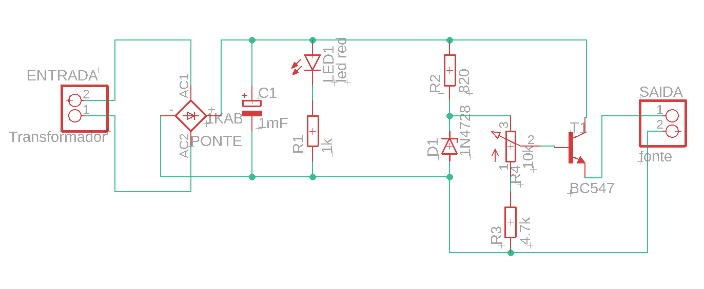
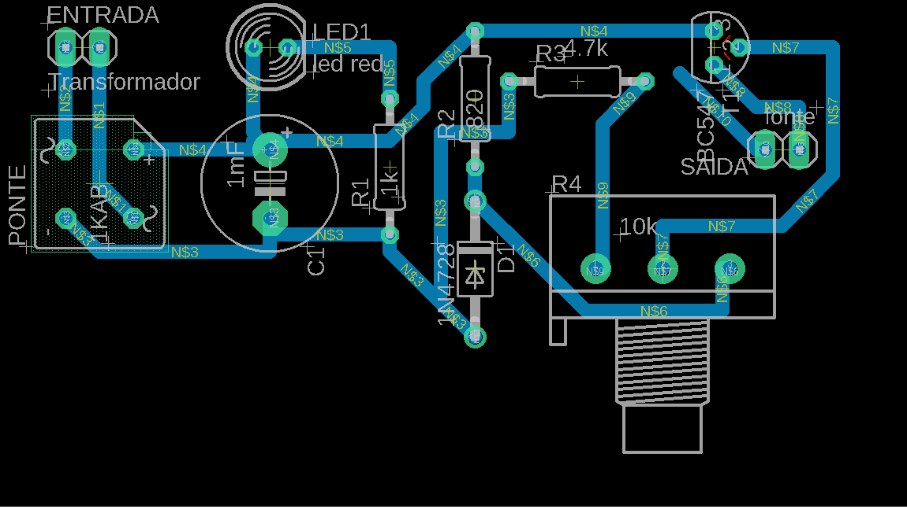

# Projeto da Fonte

## Sumário
[Integrantes](#Integrantes)  
[Objetivo](#objetivo)  
[Função de cada componente](#funcao)  
[Componentes](#Componentes)  
[Cálculos](#calculos)  
[Circuito no Falstad](#falstad)  
[Circuito no Eagle](#eagle)  
[Circuito PCB](#pcb)  

## Integrantes
<h4> Ramon Moreira Machado - Nº USP 12543179  
Victor Lucas de Almeida Fernandes - Nº USP 12675399 </h4>

## Objetivo do trabalho
Partindo de uma tomada com corrente alternada de 127V (pico de 179,6V)
e frequência de 60 Hz, construir uma fonte retificadora que consiga deixar 
a corrente contínua e ajustar a tensão para valores entre 3V e 12V.

## Função de cada componente

* **Transformador:** 
responsável pela redução da tensão que chega da tomada. O transformador
escolhido é capaz de modificar a ddp de 127V, com pico de 179,6V, para 12V, com pico de 17,287V. Como a tensão máxima 
da fonte é de 12V, escolhemos um valorde pico superior para garantir que esse resultado
consiga ser obtido, visto que os componentes do circuito consomem tensão.

* **Ponte de diodos:** 
responsável pela retificação do circuito, ou seja, por inverter o 
semiciclo negativo da corrente alternada. Assim, o circuito é abastecido com a corrente 
em ambos os semiciclos da corrente. No entanto, ainda existe variação na tensão, decorrente
da troca entre os semiciclos.

* **Capacitor:** 
responsável pela etapa de filtragem. 
O capacitor é capaz de armazenar uma determinada carga, e como o seu tempo de descarga é maior
do que o período do sinal de entrada, ele alimenta o circuito quando a corrente passa do pico e diminui 
significativamente e é recarregado durante o aumento da corrente até chegar no pico. 
Assim, ele consegue diminuir a variação de tensão no circuito, o "Ripple".

* **Resistores:**
responsáveis pelo controle da corrente que passa pelo circuito, 
evitando que os outros componentes queimem.

* **Diodo Zener:**
responsável por regular a tensão máxima do circuito. A tensão escolhida para o Zener foi de 13V, porque 
outros componentes ainda vão consumir tensão, e o valor máximo da fonte precisa ser de 12V. 
Assim, se a tensão que chega no Zener for superior a 13V, ele deixa a corrente passar com tensão de 13V.
Se for inferior a 13V, ele não influencia no circuito.

* **Potenciômetro:**
responsável pela regulação da tensão entre 3 e 12V.

* **Transistor NPN**:
responsável pela regulação da corrente elétrica.

## Cálculos

## Componentes

| Componente | Especificação | Valor |
| --- | --- | --- |
| Transformador | 12V | [R$26,99][transformador]|`R$ x`|
| Ponte de Diodos | 1N4007 | [R$0,10 x 4 = R$0,40][diodos] | |
| Capacitor | 1000uF | [R$0,79][capacitor] | |
| Resistor | 1kΩ | [R$0,05][resistor1] |
| Resistor |  | [R$0,05][resistor2] |
| Resistor |  | [R$0,05][resistor3] |
| Resistor |  | [R$0,05][resistor4] |
| Led | 5mm | [R$0,25][led]| |
| Diodo Zener | 13V | [R$0,19][zener]| |
| Potenciômetro | 10k | [R$1,79][potenciometro] | |
| Transistor | NPN | [R$0,29][npn]| |

[transformador]: https://produto.mercadolivre.com.br/MLB-989883391-transformador-trafo-1212v-200ma-bivolt-eletronica-eletrica-_JM?quantity=1#position=1&type=item&tracking_id=9abf8c61-6492-4e02-bb1d-d1a22f9b055d
[diodos]: https://www.baudaeletronica.com.br/diodo-1n4007.html
[capacitor]: https://www.baudaeletronica.com.br/capacitor-eletrolitico-1000uf-25v.html?gclid=CjwKCAjwgISIBhBfEiwALE19SV9PtG2yy8U5UN-H_dH_FWmCW822ftNFBUs8vyb2IieIiflBTjFcrRoCpP0QAvD_BwE
[led]: https://www.baudaeletronica.com.br/led-difuso-5mm-vermelho.html
[zener]: https://www.baudaeletronica.com.br/diodo-zener-1n4743-13v-1w.html?gclid=CjwKCAjwgISIBhBfEiwALE19SRW7bm8yXdRT0GTHfEzPJIUN8f9VPnWAHMp7ED1Eef8v-AIL5G_f7RoC4P0QAvD_BwE
[potenciometro]: https://www.baudaeletronica.com.br/potenciometro-linear-de-10k-10000.html?gclid=CjwKCAjwgISIBhBfEiwALE19SfFnNJtX0-Vd7lZdZ-2e183X3vlfUzLg71sWm2MVyKX1NRZIPBpZ1BoC5EsQAvD_BwE
[npn]: https://www.baudaeletronica.com.br/transistor-npn-2n2222.html?gclid=CjwKCAjwgISIBhBfEiwALE19SU9pQN6ihh4v9VTW-1ot3MlpanbD9w5BCGmXj4O_K-mzTs0KxVAMlRoClfwQAvD_BwE

[resistor1]: https://www.baudaeletronica.com.br/resistor-1k-5-1-4w.html
[resistor2]: https://www.baudaeletronica.com.br/resistor-1k-5-1-4w.html
[resistor3]: https://www.baudaeletronica.com.br/resistor-1k-5-1-4w.html
[resistor4]: https://www.baudaeletronica.com.br/resistor-1k-5-1-4w.html

## Circuito no Falstad

<h4>Link do Circuito: https://tinyurl.com/yhs23wuz</h4>
 

## Circuito no Eagle

## Circuito PCB

